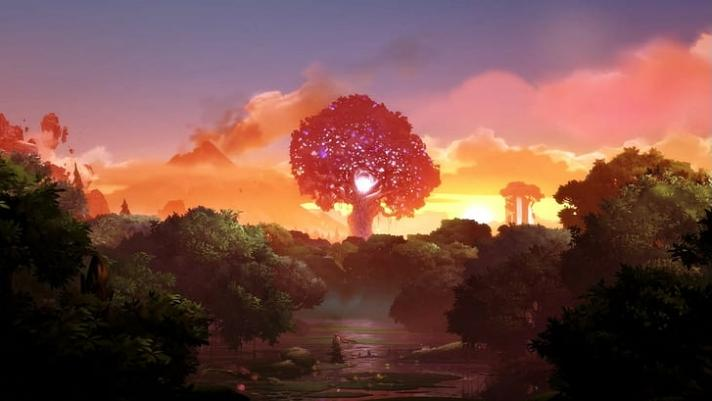

# Stylized Rolling Poster!

This is it! Here is our final Project!

## Design Doc 

### Introduction
- This idea is inspired from Wallpaper Engine, where lots of still visual graphics were recreated into animated wallpapers. Therefore we were also tempted to do the similar recreation, but with Unity and other DCC tools.
 This is a good chance to practice how to turn an aesthetical concept art piece into an interactive game scene.

### Goal

- General and transferable stylization techniques, in DCC tools or in game engine.
- Tricks that can achieve similar visual effects while maintaining a good performance.
- The capability to appreciate art.

### Reference of Inspiration

| [Starfield Rider - Dedouze](https://www.youtube.com/watch?v=ROJUZx89bz0)|
| ------------------------------------ |
|          |

| [South Africa Coastline Vintage Travel Art Poster](https://www.redbubble.com/i/art-print/South-Africa-Coastline-Vintage-Travel-Art-Poster-by-OldTravelArt/136636293.1G4ZT)| [心境](https://in.pinterest.com/pin/416020084349132844/)|[Untitled Pixel Art](https://www.pinterest.com/pin/91127592458530014/) |
|:--:|:--:|:--:|
| | | |

| Ori and the Blind Forest（Daytime）|Ori and the Blind Forest（Evening）|
|:--:|:--:|
| | |

### Main Features
- Procedural generated terrain and foliage and corresponding textures.
- Sea shader (animation, color, foam, reflection, depth based color)
- Sand shader (interact with sea)
- Skybox (stars, color gradient, moon)
- Cloud (volumetric cloud or billboard cloud)
- Scene props (lighthouse, stones, tiny creatures)
- Stylized Fonts
- Weather System(Rain, Snow, etc. )
- Interaction System(?)

### Techniques
- Use Unity for Custom Shader and Houdini for procedrual generated assets.
- Cel shading with distorted normal and utilization of ramp textures
- Some offline npr techniques could be used (rotating billboards) 
- Most of the similar effect is done with blender. So we will probably draw some inspiration from blender tutorials
- References:
   - [Tutorial: Anime style clouds and starry nightsky in blender](https://www.youtube.com/watch?v=m4aOZm6auxQ)
   - [Sunset Cliffs | Free Assets Only | Environment Design | Speed Level Design | Unity | HDRP](https://www.youtube.com/watch?v=Ad0okjU-SBA)
   - [wave animation anime npr -blender](https://www.youtube.com/watch?v=cqZh4Nvum6A)

### Design
 

### Timeline

#### Milestone 1 (due 11/13)
- Basic skybox shader - Jinxiang Wang
- Basic sand terrain and shader - Jichu Mao
- Basic cliff - Zhiyi Zhou

#### Milestone 2 (due 11/25)
- Sky details and cloud - Jinxiang Wang
- Foliage - Jinxiang Wang
- Rain Effect - Jichu Mao
- Weather system - Jichu Mao
- Sea shader - Zhiyi Zhou

#### Milestone 3 (due 12/2)
- Post process - Jinxiang Wang
- Final scene integration and setup  - Jichu Mao
- Shader effect polish - Jichu Mao
- Scene props - Zhiyi Zhou

### Milestone 1

#### Jichu Mao
| Sand Shader with Procedural Texture|
|:--:|
| |
| |

In the milestone 1, I implemented a height map based on Perlin noise and Voronoi noise, along with procedural textures, then combined them into a Sand Shader. I added many adjustable parameters in the shader, allowing users to customize various attributes, such as colors of different sections, texture density and orientation, overall smoothness, highlight color, and more. With these extensive options, users can create their desired artistic effect.

| Sand Shader with Detailed Parameters Control|
|:--:|
| |
| |

### Milestone 2

#### Jichu Mao
- Implementation of a rain effect shader

- Implementation of a rain-on-window effect shader

- Initial implementation of a weather system

### Milestone 3

#### Jichu Mao
- Integration of teammates' basic implementations and design, assembly, and setup of the final scene

- Polishing the scene's weather system

- Adding sound effects for weather transitions

## References
- [Creating a Sand Shader](https://www.youtube.com/watch?v=KqWfo6EPjCw&t=947s)
- [Unity | Raindrops Shader](https://www.youtube.com/watch?v=dQSLjsDAzw0)
- [Making a rainy winodw in Unity](https://www.youtube.com/watch?v=EBrAdahFtuo)