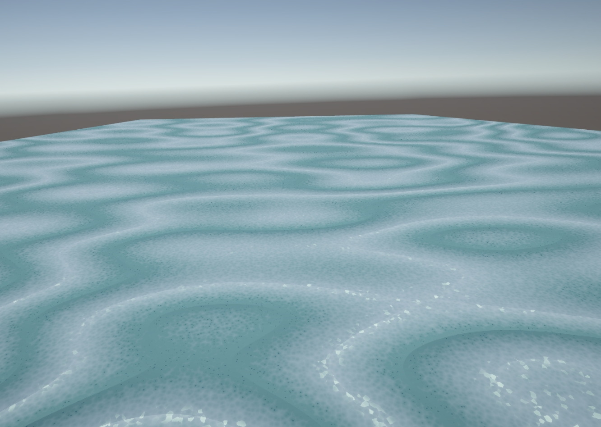
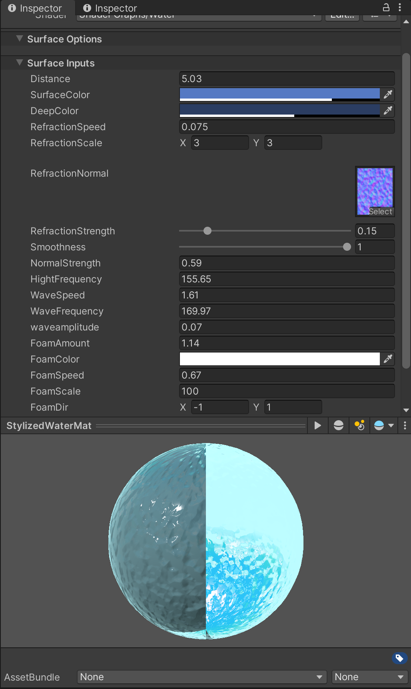

# Stylized Rolling Poster!

This is it! Here is our final Project!

## Highlight

https://github.com/user-attachments/assets/e68278bf-0364-47d8-9f1d-f03cffab7d8e

## Design Doc

### Introduction

-   This idea is inspired from Wallpaper Engine, where lots of still visual graphics were recreated into animated wallpapers. Therefore we were also tempted to do the similar recreation, but with Unity and other DCC tools.
    This is a good chance to practice how to turn an aesthetical concept art piece into an interactive game scene.

### Goal

-   General and transferable stylization techniques, in DCC tools or in game engine.
-   Tricks that can achieve similar visual effects while maintaining a good performance.
-   The capability to appreciate art.

### Reference of Inspiration

| [Starfield Rider - Dedouze](https://www.youtube.com/watch?v=ROJUZx89bz0) |
| ------------------------------------------------------------------------ |
|                                                       |

| [South Africa Coastline Vintage Travel Art Poster](https://www.redbubble.com/i/art-print/South-Africa-Coastline-Vintage-Travel-Art-Poster-by-OldTravelArt/136636293.1G4ZT) | [心境](https://in.pinterest.com/pin/416020084349132844/) | [Untitled Pixel Art](https://www.pinterest.com/pin/91127592458530014/) |
| :------------------------------------------------------------------------------------------------------------------------------------------------------------------------: | :------------------------------------------------------: | :--------------------------------------------------------------------: |
|                                                                                                                                       |                     |                                   |

|  Ori and the Blind Forest（Daytime）  |  Ori and the Blind Forest（Evening）  |
| :-----------------------------------: | :-----------------------------------: |
|  |  |

### Main Features

-   Procedural generated terrain and foliage and corresponding textures.
-   Sea shader (animation, color, foam, reflection, depth based color)
-   Sand shader (interact with sea)
-   Skybox (stars, color gradient, moon)
-   Cloud (volumetric cloud or billboard cloud)
-   Scene props (lighthouse, stones, tiny creatures)
-   Stylized Fonts
-   Weather System(Rain, Snow, etc. )
-   Interaction System(?)

### Techniques

-   Use Unity for Custom Shader and Houdini for procedrual generated assets.
-   Cel shading with distorted normal and utilization of ramp textures
-   Some offline npr techniques could be used (rotating billboards)
-   Most of the similar effect is done with blender. So we will probably draw some inspiration from blender tutorials
-   References:
    -   [Tutorial: Anime style clouds and starry nightsky in blender](https://www.youtube.com/watch?v=m4aOZm6auxQ)
    -   [Sunset Cliffs | Free Assets Only | Environment Design | Speed Level Design | Unity | HDRP](https://www.youtube.com/watch?v=Ad0okjU-SBA)
    -   [wave animation anime npr -blender](https://www.youtube.com/watch?v=cqZh4Nvum6A)

### Design

### Timeline

#### Milestone 1 (due 11/13)

-   Basic skybox shader - Jinxiang Wang
-   Basic sand terrain and shader - Jichu Mao
-   Basic cliff - Zhiyi Zhou

#### Milestone 2 (due 11/25)

-   Sky details and cloud - Jinxiang Wang
-   Foliage - Jinxiang Wang
-   Rain effect - Jichu Mao
-   Rain-on-window effect -Jichu Mao
-   Sea shader - Zhiyi Zhou

#### Milestone 3 (due 12/2)

-   Post process - Jinxiang Wang
-   Weather system - Jichu Mao
-   Shader effect polish - Jichu Mao
-   Final scene integration and setup - Zhiyi Zhou
-   Scene props - Zhiyi Zhou

### Milestone 1

#### Jichu Mao

|  Sand Shader with Procedural Texture  |
| :-----------------------------------: |
|    |
|  |

In the milestone 1, I implemented a height map based on Perlin noise and Voronoi noise, along with procedural textures, then combined them into a Sand Shader. I added many adjustable parameters in the shader, allowing users to customize various attributes, such as colors of different sections, texture density and orientation, overall smoothness, highlight color, and more. With these extensive options, users can create their desired artistic effect.

| Sand Shader with Detailed Parameters Control |
| :------------------------------------------: |
|         |
|          |

#### Zhiyi Zhou

Basic water Shader. I use sin wave to change the position of water plane and use a normal map to disturb the normals of the water surface.

 

#### Jinxiang Wang

Created skybox via blender [skybox.blend](External/skybox.blend)
Wrote a custom skybox shader.

|  |
| ------------------------------------------------------------- |
| Skybox Nodes                                                  |

|  |  |
| ------------------------------------------------------------ | ------------------------------------------------------- |
| Skybox Nodes                                                 | Skybox Nodes                                            |

### Milestone 2

#### Jichu Mao

In milestone 2, I finished rain shader , Rainy Window Shader, and basic weather system by Amplify Shader Editor.

##### Implementation of a rain effect shader

|              Rain Shader               |
| :------------------------------------: |
|  |
|  |

_Dynamic Raindrop Generation and Motion_

The shader achieves realistic raindrop motion by leveraging dynamic UV transformations and time-based adjustments.
Two `Texture 2D` nodes supply distinct raindrop textures, which are moved using `Panner` nodes with UV offsets driven by the `Time` node.
This setup simulates continuous rainfall. To enhance complexity, the shader blends these layers using an `Add` node to overlay textures,
representing raindrops at varying depths. The randomness of raindrop distribution is enhanced by applying operations like Apower and `Divide` on UV coordinates,
introducing non-linear transformations for more natural effects. Additionally, `Register Local Var` ensures optimized data reuse, avoiding redundant computations and improving performance.

_Masking and Edge Control for Realism_

A radial gradient mask generated through the `Distance` node defines the region where raindrops are rendered. This mask is refined using a Power node to control the softness of transitions at the edges. A `One Minus` node inverts the mask for seamless integration with the texture's alpha channel. The resulting values modulate the `Opacity` output, ensuring raindrops fade out gradually towards the boundaries. The final `Base Color` integrates blended raindrop textures with the mask for a cohesive effect. This masking strategy not only enhances realism but also optimizes rendering by focusing computations on relevant areas.

|              Rain Effect               |
| :------------------------------------: |
|  |

##### Implementation of a rain-on-window effect shader

The shader creates the illusion of rain sliding down a window by simulating individual raindrops with layered procedural techniques. Each raindrop is generated using procedural noise and smoothly moves downward over time, with slight oscillations to replicate the natural randomness of water droplets. Multiple layers of rain are implemented at different scales and speeds, creating depth and enhancing the sense of realism. The trails left behind by droplets are carefully blended into the scene, resembling the streaks of water that naturally form as rain flows across a surface. This layering approach provides a rich visual effect, as droplets interact dynamically with the environment.

|            Rain-on-window Effect            |
| :-----------------------------------------: |
|  |

In addition to simulating rain motion, the shader incorporates screen-space effects to create a more immersive visual experience. As droplets flow, they distort the background, mimicking the optical effects seen when looking through water. The shader dynamically adjusts focus and blur to enhance this distortion, adding depth-of-field effects that respond to the proximity of the droplets. Post-processing techniques, such as vignetting and subtle color shifts, are applied to integrate the rain effect naturally into the scene. Together, these elements create a cohesive and realistic simulation of rain sliding down a glass surface, enhancing the atmospheric quality of the visual presentation.

#### Zhiyi Zhou

Improve the sea shader, add foam effect to the edges.

Improve the sea shader, add foam effect to the edges.

#### Jinxiang Wang

Added 4-channel cloud, [cloud.blend](External/clouds.blend)
Applied order indipendent transparency to solve transparency issue

|  |
| ----------------------------------------------------------- |
| Cloud Mesh                                                  |

|  |  |  |  |
| ---------------------- | ---------------------- | ---------------------- | ---------------------- |
| Cloud R Channel        | Cloud G Channel        | Cloud G Channel        | Cloud G Channel        |

Explanation:

-   R: fake NdotL, used for sampling ramp texture
-   G: rim light mask, multiply schlick-fresnel term with this mask to get rim light
-   B: cloud shape sdf, control shape of a cloud by giving a threshold
-   A: alpha chanel

Why OIT? (Order Independent Transparency)

-   When transparent surfaces intersect, the internal color is often messed up.
-   By reordering the transparent fragments based on depth, we can have a correct result

|  |  |
| ------------------------- | ------------------------ |
| Before OIT                | After OIT                |

The method applied here is one of the many OIT methods, Per-Pixel Linked Lists, which creates a linked list for each pixel whose value is a color of a fragment in this pixel.
The linked lists are calculated and updated through a compute pass. [Package Repo](https://github.com/happy-turtle/oit-unity?tab=readme-ov-file)

### Milestone 3

#### Jichu Mao

-   Weather system

I integrates multiple rain-related shaders into the final scene, creating a weather control system. The system allows switching between different sets of scene objects using a simple input, such as pressing the spacebar, to simulate varying weather conditions. This setup provides flexibility for testing and adjusting weather effects. In this milestone, I finally implemented the weather system switching functionality. For example, when the weather switches to rain, there are sound effects of thunder and rain, and these sound effects start or stop with the weather change.

-   Shader effect polish - Jichu Mao

For polishing the shader effects, I customized various shader materials for the final scene, including day and night versions. Considering the final presentation effect at night, I adjusted shader parameters and added more parameter controls to the rain shader, allowing users to switch between different rain volumes and rain speeds for more convenient use.

#### Zhiyi Zhou

-   Design and set up final scene.
-   Enhance the cloud performance.

#### Jinxiang Wang

-   Add a moon to the skybox.
-   Tweak parameters and fix artifacts of all scene shaders
-   Add post processing
-   Create a terrain using terrain tool

## Post Mortem

Our project has largely achieved its initial goals, including the creation of dynamic scene-like posters, akin to the dynamic wallpapers seen in software like Wallpaper Engine. This accomplishment reflects one of our primary objectives, and we believe we have come very close to fully realizing our vision.

During the development process, we frequently adjusted our approach as we explored what was feasible. While we had a reference image to guide us, we faced uncertainties about our capabilities and thus relied on extensive online research to enhance our skills. A significant portion of our efforts was dedicated to unifying different models and shaders, as well as fine-tuning shader parameters, to produce a consistent and visually appealing outcome.

Through this journey, we gained valuable experience in iterative planning and harmonizing visual elements to achieve a unified style. Looking ahead, we aspire to refine this tool further and eventually upload it to the Wallpaper Engine library, making it accessible for others to enjoy.

## References

-   [Anime style clouds and starry nightsky in blender](https://www.youtube.com/watch?v=m4aOZm6auxQ)
-   [Sunset Cliffs](https://www.youtube.com/watch?v=Ad0okjU-SBA)
-   [Wave animation anime npr -blender](https://www.youtube.com/watch?v=cqZh4Nvum6A)
-   [Amplify Shader Editor](https://amplify.pt/unity/amplify-shader-editor/)
-   [Sand Shader - Advanced Materials](https://www.youtube.com/watch?v=NDb4WpE5bak)
-   [Tutrorial for Sand Shader](https://www.youtube.com/watch?v=KqWfo6EPjCw&t=947s)
-   [Unity | Raindrops Shader](https://www.youtube.com/watch?v=dQSLjsDAzw0)
-   [A rain Shader](https://www.youtube.com/watch?v=-SeGSp0odqs)
-   [Making a rainy winodw in Unity](https://www.youtube.com/watch?v=EBrAdahFtuo)
-   [Creating a Dynamic Real-Time Weather System in Unity - Water Shading, Puddles & Rain Effects](https://www.youtube.com/watch?v=SYKG3OQRJig&t=248s)
